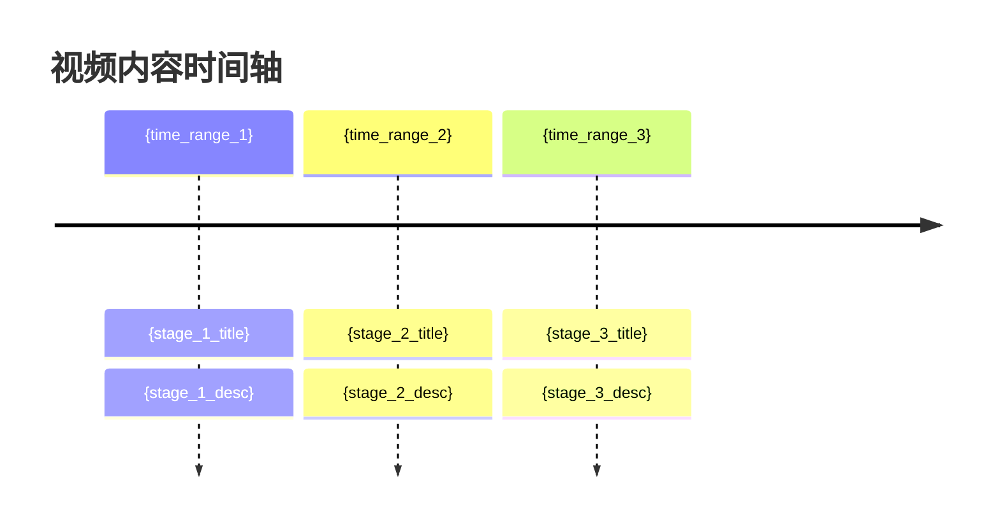

# 视频解析文档模板

```markdown
---
bvid: "{bvid}"
title: "{title}"
author: "{author}"
url: "{url}"
duration: "{duration}"
pubdate: "{pubdate}"
source: "{subtitle|transcribe}"
analyzed_at: "{YYYY-MM-DD HH:MM:SS}"
---

# {title}

> **UP主**: {author} | **时长**: {duration} | **播放**: {view_count}
>
> **链接**: {url}

---

## 中心思想

1. **观点**: {idea_1}
   > 关联发言: "{evidence_1}"
   > 时间: {time_1}

2. **观点**: {idea_2}
   > 关联发言: "{evidence_2}"
   > 时间: {time_2}

3. **观点**: {idea_3}
   > 关联发言: "{evidence_3}"
   > 时间: {time_3}

---

## 视频时间轴图



### 时间轴要点（可选）
- {timeline_point_1}
- {timeline_point_2}

...

---

## 完整文本（可选）

<details>
<summary>展开查看完整字幕文本</summary>

{full_transcript}

</details>

> 若用户选择不保留完整文本，可删除本节并保留上方结构化分析结果。

---

_解析时间: {analyzed_at} | 文本来源: {source}_
```
